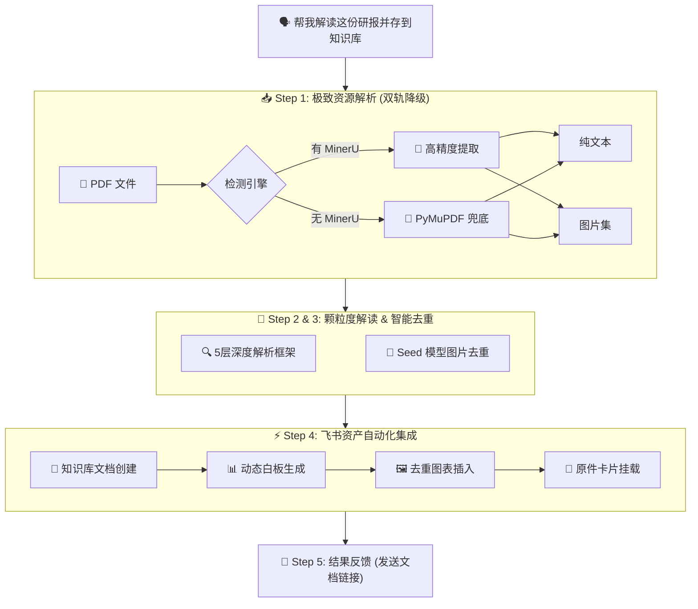

<div align="center">
  <h1>📄 研报解读专家 (Lark Research Analyst)</h1>
  <p><strong>飞书全平台研报自动解析与深度沉淀神器 · 基于飞书 CLI 开发</strong></p>
  <p>一句话触发 PDF 研报的极致解析：自动提取纯文本与高清图表、Seed 模型去重过滤、5 层结构深度逻辑拆解、动态白板可视化，并一键封包至飞书知识库。</p>
</div>

## 🤔 它解决什么问题

每天我们都会收到各种长篇累牍的 PDF 行业研究报告、深度分析报告。面对动辄几十上百页的 PDF：
- **自己看**：耗时费力，看完一圈抓不到核心逻辑，信息难以系统化提炼。
- **丢给传统 AI 对话框**：只能给你一段干瘪泛泛的“内容摘要”，不仅丢了原版精美的数据图表，也难以深挖作者背后的战略意图与隐藏假设。

所以我开发了 **Lark Research Analyst**：只需一句话，自动完成 PDF 的图文双轨解析。AI 将采用专业的 5 层分析框架（快速浏览、逐层加深、削减噪音、摘要核心、批判性思考）进行颗粒度级解读，同时在解读文档中插入高清原图，并自动绘制逻辑白板图。最后，将所有产物连同 PDF 原件卡片，整齐划一地沉淀到你的飞书知识库中。

### 🧭 Before / After

| 对比维度 | 传统方式（手动看/普通AI） | Lark Research Analyst (本 Skill) |
| --- | --- | --- |
| **阅读耗时** | 1~2 小时逐页翻看 | **2~3 分钟**，AI 后台并发解析 |
| **信息提炼** | 靠直觉，容易遗漏关键逻辑和风险点 | **5 层深度框架**，剥洋葱式拆解，直击本质 |
| **图表留存** | 无法提取，或需手动截图粘贴 | **高清无损提取**，Seed 模型智能去重冗余图片，自动插图 |
| **逻辑呈现** | 只有枯燥的文字 | **动态白板可视化**，自动绘制架构图/逻辑链 |
| **知识沉淀** | 散落在聊天记录和本地文件夹中 | **自动封包**为结构化飞书云文档，存入指定知识库，并返回链接 |

## 💬 一句话怎么用

> _"把 `report.pdf` 帮我解读并同步至知识库：`7631384852998147284` 中。"_

AI Agent 自动完成以下全套流程：

1. **极致资源解析 (Extract)**：智能判断系统环境，优先调用高精度解析引擎（MinerU）或基础引擎（PyMuPDF）提取纯文本及高清图片。
2. **颗粒度解读 (Analyze)**：严格按照 5 层框架对研报进行“逻辑拆解”，找出作者动机、增量信息、逻辑漏洞与落地阻力。
3. **多维资产集成 (Integrate)**：利用 Seed 模型过滤掉无用的重复图片（如相同的页眉页脚），并在解读文档对应段落下方插入去重后的关键图表。
4. **白板可视化 (Visualize)**：自动为每一层分析生成 Mermaid/DSL 白板，直观呈现复杂的逻辑模型。
5. **文档封包归档 (Archive)**：在飞书文档末尾插入 PDF 原件文件卡片，并将最终文档地址链接反馈给你。

## 🏗️ 架构与工作流



## 🛠️ 安装与配置

### 前置依赖
1. 确保已安装 [飞书 CLI (lark-cli)](https://github.com/larksuite/cli) 并完成登录授权：
   ```bash
   lark-cli auth login
   ```
2. 确保本地拥有 Python 环境，并安装 `PyMuPDF`：
   ```bash
   pip install PyMuPDF
   ```

### 导入 Skill
将本仓库中的 `skills/lark-research-analyst` 文件夹克隆或复制到你的 Lark CLI skills 目录中，即可直接使用。

## 🎯 产出文档结构示例

最终生成的飞书文档将包含以下标准结构：
1. **封面/元数据** (标题、标签、解读日期)
2. **结构化深度解读报告** 
   - Layer 1: 快速浏览 (意图与亮点)
   - Layer 2: 逐层加深 (底层逻辑与假设)
   - Layer 3: 削减无用信息 (增量信息与共识)
   - Layer 4: 摘要核心信息 (数据矩阵与结论)
   - Layer 5: 批判性思考 (证伪分析与阻力)
3. **可视化组件** (动态白板，穿插于各层级)
4. **关键原始图表** (去重后的高清配图)
5. **原始报告全文参考** (以文件卡片形式呈现)

---
*本项目为「飞书 CLI 创作者大赛」参赛作品。*
