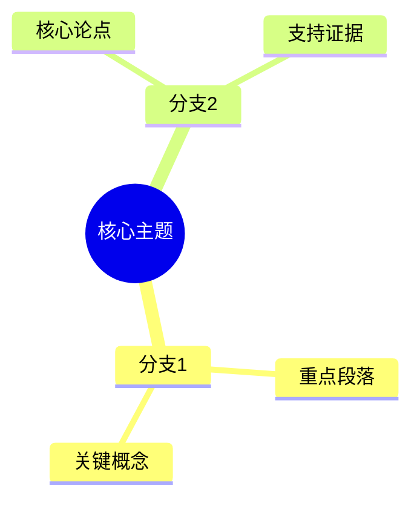
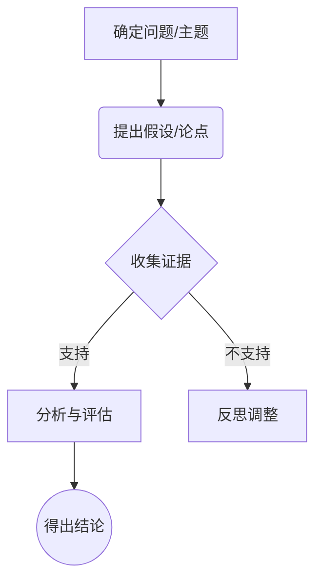
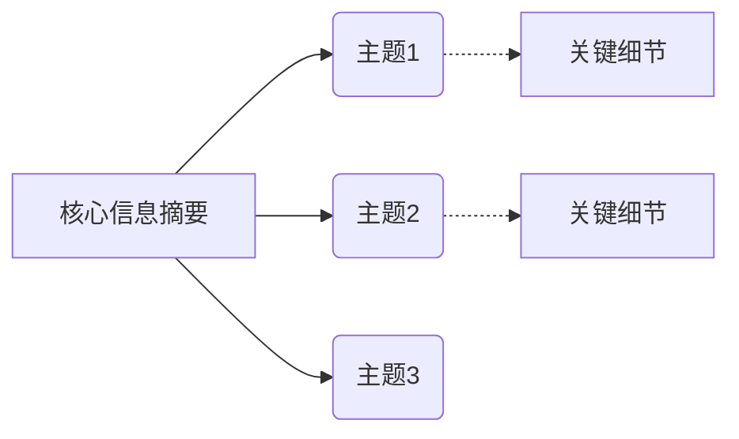

# 飞书白板 DSL 模板指南

飞书白板支持通过内建的 DSL（领域特定语言）来绘制节点、图表及组织结构。在每一层分析后，请利用白板能力展现报告的核心信息。

## DSL 基本原则
- 飞书白板 DSL 是基于 Mermaid 和 PlantUML 的一种描述语言封装。
- 节点支持：文本、矩形、菱形、圆角矩形等。
- 连线支持：直线、箭头线、双向箭头等。
- 支持调整节点位置和相对布局。

## 常用结构模板参考

### 1. 核心主题脑图 (Mindmap)
用于第一层和第二层总结，展示整体主题与核心分支。

### 2. 逻辑流图 (Flowchart)
用于展示第五层的批判性思考框架或论证逻辑。

### 3. 层级拆解图
用于第四层（摘要核心信息）展示多主题之间的关联。

## 注意事项
1. 根据报告解析后提取出的具体文本内容动态生成对应的 DSL 结构。
2. 若节点文本过长，请进行适当的换行或精简，保证白板的可读性。
3. 确保每层解读后均有一张与之对应的白板。
4. 调用 `lark-whiteboard` 命令时，将这些 DSL 代码直接转换为飞书支持的白板元素，再将生成的白板节点插入到飞书文档的指定层级下方。